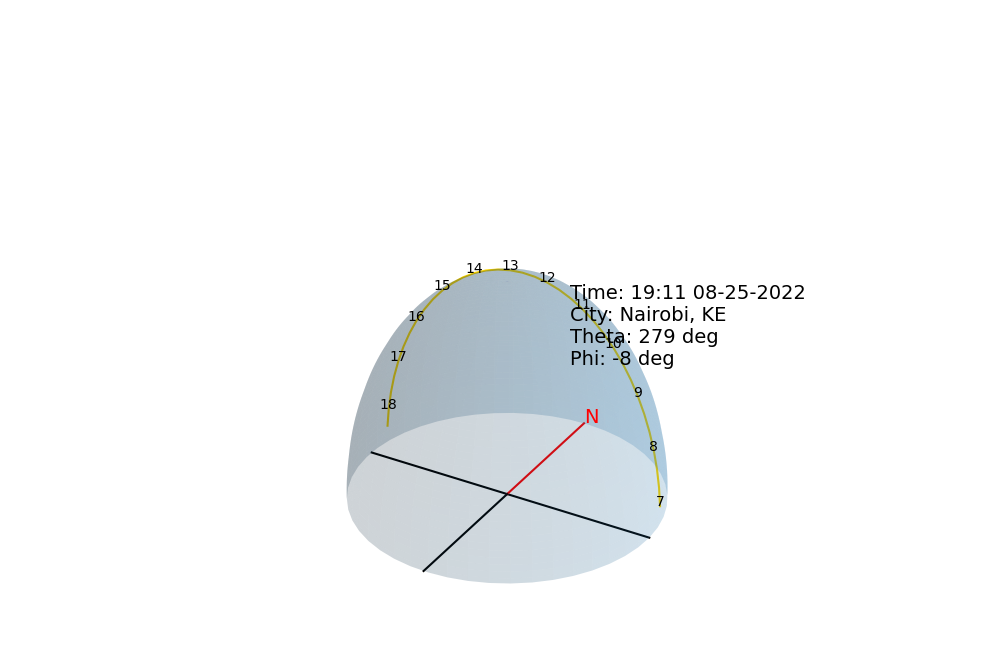
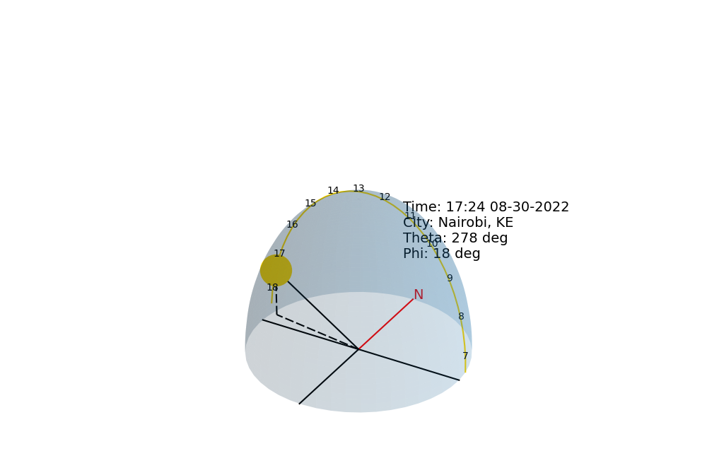

# Solar-Tracker
Solar tracking software that assist in positioning the panels to a position for solar energy optimal absorption

## Motive.
This Project is based on the principle that at any geographical position on the surface of the earth, there is an angle of tilt/elevation by which the rays of the sun hits the surface. 

## Sample plot:

### Sample 1
This sample has been taken on date 25-08-2022 1911hrs. 
Note: 
* No sun, it's evening.  

### Sample 2
* This sample has been taken on date 30-08-2022 1724hrs.
  

## How to run this project.
* First, clone this repository / fork then clone this repo.
* I recommend installing the packages in a virtual environment using pip.
* Activate the virtual environment
* run `python main.py` or `python3 main.py`
